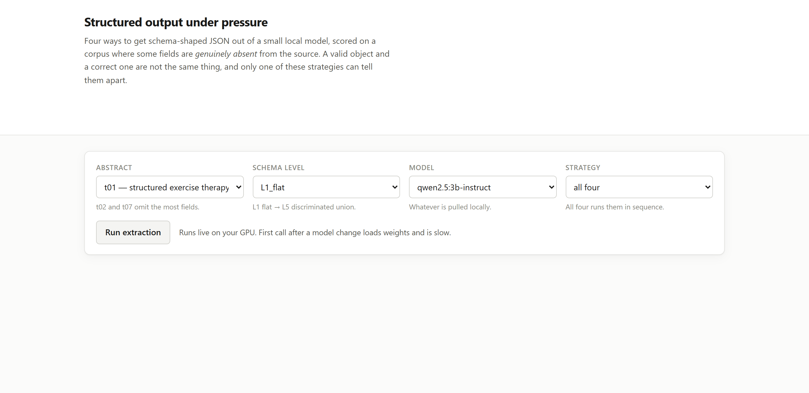
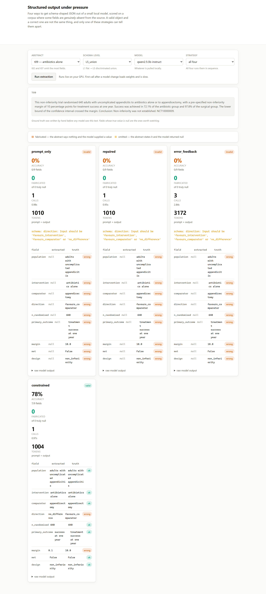
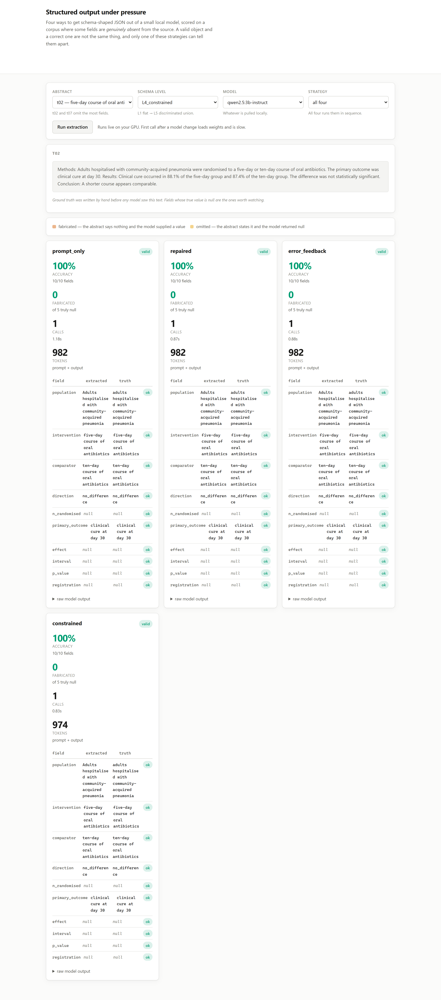

# 01 · Structured output under pressure

**A valid document and a correct one are different things, and the metric everyone reports
cannot tell them apart.**

Four ways to get schema-shaped JSON out of a small local model, measured on a corpus of
clinical-trial abstracts where some fields are **genuinely absent from the source** and the
correct answer is `null`.

The project was built to prove that grammar-constrained decoding buys validity at the cost of
inventing content. It does not. What it proved instead is that the *standard way of measuring
this* invents a result.

---

## The finding

Run the grid once with the obvious scoring — accuracy over the extractions that parsed — and
the hardest schema level says this:

| L5 (discriminated union) | validity | accuracy |
|---|---|---|
| `prompt_only` | 25% | **96%** |
| `constrained` | 100% | 77% |

A clean story: constraints cost you 19 points of accuracy. It is also false. `prompt_only`
parsed 3 of 12 abstracts, and that 96% is its score *on the three it managed* — necessarily
the easy ones. The nine failures contributed nothing to the denominator, so they cost it
nothing.

Charge every failed extraction for the fields it owed, change nothing else, and re-run:

| L5 (discriminated union) | validity | accuracy (as usually measured) | accuracy (corrected) |
|---|---|---|---|
| `prompt_only` | 25% | 96% | **23%** |
| `repaired` | 25% | 96% | **23%** |
| `error_feedback` | 50% | 92% | **45%** |
| `constrained` | 100% | 77% | **77%** |

> The conclusion does not move. It **inverts**. Constrained decoding is not trading accuracy
> for validity — it is **more than three times more accurate** at this level, and the ordinary
> metric hid that behind an average computed over survivors.

This is the same error as reporting a trial's outcome only for the patients who completed it.

## What the original hypothesis was, and why it failed

The corpus was built so that four fields are frequently absent — 4 abstracts omit the
participant count, 6 omit a confidence interval, 5 omit a p-value, 5 have no registration ID.
A grammar that *permits* `null` does not make `null` likely, so a constrained model was
expected to fill those gaps with well-typed inventions.

It does, on 27% of them. So does every other strategy, on 27% of them:

| strategy | valid | accuracy | fabrication | omission | calls |
|---|---|---|---|---|---|
| `prompt_only` | 85% | 74% | 27% | 1% | 60 |
| `repaired` | 85% | 74% | 27% | 1% | 60 |
| `error_feedback` | 90% | 79% | 24% | 1% | 75 |
| `constrained` | **100%** | **84%** | 27% | 4% | 60 |

**Fabrication is a property of the model, not of the decoding strategy.** It does not move when
the decoding method changes, because the model's willingness to invent a participant count has
nothing to do with how its tokens are sampled. The corpus was designed to catch constrained
decoding making things up, and it caught the evaluation method making something up instead.

Two real costs survive, and they are footnotes rather than headlines:

- At **L4 only**, forcing validity does cost accuracy: 82% against 88%.
- Omission rises from 1% to 4% — constrained decoding returns `null` for a stated value
  slightly more often.

## The strategies

| | what it does | result |
|---|---|---|
| `prompt_only` | Ask for JSON, parse what comes back. | 85% valid |
| `repaired` | Strip fences, fix trailing commas and Python literals, then parse. | **identical to `prompt_only`, on every cell** |
| `error_feedback` | On a validation failure, hand the model its own errors; up to 3 attempts. | +5 points validity for 25% more calls |
| `constrained` | Pass the JSON Schema to ollama as `format`. Invalid output is unrepresentable. | 100% valid, best accuracy |

`repaired` producing numbers byte-identical to `prompt_only` across all twenty cells is a
negative result worth keeping: when this model emitted JSON at all, the JSON was already
clean. The repair layer solves a problem `qwen2.5:3b-instruct` does not have. It is kept
because it is nearly free, and because "the obvious defensive layer did nothing" is more
useful to a reader than silence.

## The schema ladder

Difficulty rises while the task is held constant, so a drop in accuracy is attributable to the
schema rather than to the question.

| | shape | validity (worst strategy) |
|---|---|---|
| L1 | three required strings | 100% |
| L2 | an enum and a nullable int | 100% |
| L3 | a list of nested objects | 100% |
| L4 | constrained numerics, a regex-patterned ID, a nested interval | 100% |
| L5 | a **discriminated union** | **25%** |

Everything up to L4 is handled by a 3B model without difficulty. The cliff is at L5: a
discriminated union requires committing to one branch and then satisfying only that branch's
fields, and unconstrained generation gets it right a quarter of the time.

## The corpus

Twelve abstracts, hand-written for this repo, with ground truth written before any model saw
them. **They are synthetic and the registration IDs are invented** — real abstracts were not
used because their ground truth is itself a judgement call, and because attaching extracted
medical claims to a toy model is a good way to put a wrong number on the internet.

What makes them useful is the pattern of omissions, pinned by
`test_omission_balance_is_pinned` so that a corpus edit cannot silently change what a
fabrication rate means.

## Run it

```bash
make install
ollama pull qwen2.5:3b-instruct

make bench01                # regenerates RESULTS.md; nothing in this README is typed by hand
make web01                  # http://127.0.0.1:8101
```

The web UI runs a single abstract through any or all four strategies live and marks every
disagreement — **red for fabricated** (the abstract says nothing, the model supplied a value)
and **orange for omitted** (the abstract states it, the model returned `null`).



The clearest thing to run is `t09` at **L5**, which is the whole finding on one screen. Three
strategies return nothing usable — and the schema errors they return are worth reading, since
both failures are the union discriminator. `constrained` returns a valid document scoring 7/9:



Note what the corrected scoring does here. The three failures read **0%**, not "no result" and
not a score computed over nothing. That is the denominator fix visible in a single view: a
strategy does not get to be accurate on the attempts it never completed.

`constrained`'s two errors are real and worth seeing rather than hiding — it reports
`direction: no_difference` where the truth is `favours_comparator`, and a non-inferiority
`margin` of `0.1` where the abstract says 10 percentage points. Valid, well-typed, and wrong.

By contrast, `t02` at L4 — which omits four fields — is handled perfectly by all four
strategies, fabricating nothing:



That screenshot is kept precisely because it is undramatic. The fabrication this project was
built to catch is not reliably reproducible on a single abstract; it is a 27% rate across the
corpus, and a demo that only ever shows the failure case would misrepresent how often it
happens.

## What this does NOT do

- **It does not test a hosted model.** Every number here is `qwen2.5:3b-instruct` on one
  machine. Whether GPT-4-class models fabricate at 27% is not something this measures, and the
  fabrication finding should be assumed local to this model until the fleet is larger.
- **It is not a multi-model result yet.** The registry holds six models and the benchmark
  iterates whatever is installed, but only one was pulled when these numbers were produced.
  The "By model" table in `RESULTS.md` has one row and says so.
- **It does not use real trial data**, so nothing here is a claim about clinical evidence.
- **It does not measure `temperature > 0`.** Everything runs at 0. A comparison against a
  randomly sampled baseline measures the sampler.
- **It does not claim `constrained` is always right.** It is worse at L4, and it raises the
  omission rate.

## Problems hit while building this

The full account is in [`docs/BUILD_LOG.md`](../../docs/BUILD_LOG.md). The three worth knowing:

1. **The scorer was survivorship-biased** and produced a confident, plausible, inverted
   result. It did not crash. This is the entire project.
2. **`bool` is a subclass of `int` in Python**, so `bool(1.5) == bool(True)` scored a
   non-inferiority margin of 1.5 as a correct `met: true`.
3. **JSON repair corrupted a legitimate string** — a regex rewriting `None` to `null` across
   the whole document turned the value `"None of the above"` into `"null of the above"`.
