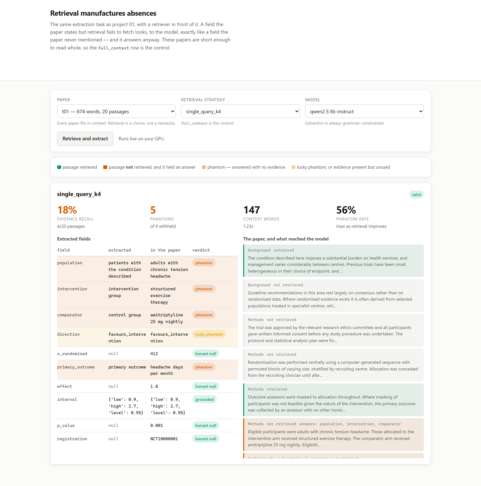
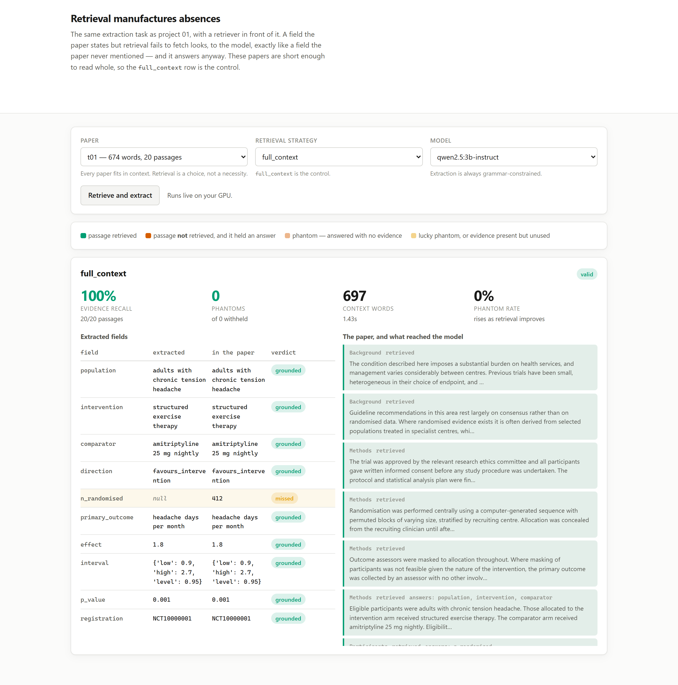
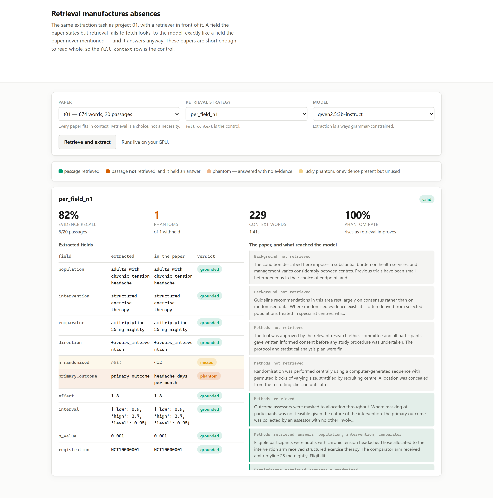

# 02 · Retrieval manufactures absences (LangChain, Ollama, nomic-embed-text, FastAPI)

**Putting a retriever in front of a document the model could have read whole cost 53 points of
accuracy, and turned missing evidence into invented values 69% of the time.**

Project 01 asked what a model does when a document genuinely does not state a field. This one
adds the step every production pipeline adds — retrieve first, then extract — and finds that
the step creates a second kind of absence that is invisible from inside the model.

---

## The two absences

| | the model sees | the truth |
|---|---|---|
| **True absence** | nothing | the paper does not report it |
| **Manufactured absence** | nothing | the paper reports it; retrieval did not fetch it |

These are identical from the model's position and completely different from the reader's. An
ordinary fabrication can at least be blamed on a silent source. A **phantom** — a value produced
for a field whose evidence was withheld by the pipeline — happens on a document that *does*
state the answer, so a reviewer who checks the paper finds the field there and assumes the
extraction was grounded.

Measuring the difference requires knowing where every fact lives. So papers here are not prose
that is hoped about; they are composed from labelled `Passage` objects, each declaring which
ground-truth fields it contains. Whether the evidence reached the model is then true by
construction rather than inferred from the output.

## The result

Same model, same schema, same prompt, same extraction strategy. The only variable is what
reached the context.

| strategy | context | recall | accuracy | phantom rate | phantoms |
|---|---|---|---|---|---|
| `full_context` | 649 w | 100% | **82%** | — | 0 |
| `single_query_k4` | 148 w | 17% | **29%** | 69% | 61 |
| `single_query_k8` | 283 w | 33% | 33% | 86% | 54 |
| `per_field_n1` | 227 w | 78% | **79%** | 100% | 11 |
| `per_field_n2` | 364 w | 83% | 76% | 100% | 9 |

**Accuracy fell from 82% to 29%** on documents the model was perfectly capable of reading in
full. Of the 89 fields that `single_query_k4` withheld despite the paper stating them, **61 came
back as invented values** rather than as nulls.

## What the model does with a withheld field

It does not say it does not know. Constrained decoding cannot — a required string field must
contain a string. So on `t01` it returns:

| field | in the paper | returned |
|---|---|---|
| `intervention` | structured exercise therapy | **"intervention group"** |
| `comparator` | amitriptyline 25 mg nightly | **"control group"** |
| `primary_outcome` | headache days per month | **"primary outcome"** |
| `effect` | 1.8 | **1.85** |

The first three are the schema's own field names echoed back as their values — the question
returned as the answer. That is recognisable as junk on inspection. `effect: 1.85` is the
dangerous one: a plausible number, correctly typed, wrong, and indistinguishable from a real
extraction without opening the paper.

This connects directly to project 01. Grammar-constrained decoding was the **best** strategy
there — most valid, most accurate. It is the best one here too. But its guarantee is structural,
not epistemic: it can promise a well-formed answer and it cannot promise a grounded one, and
with a retriever upstream that gap is where the damage lands.

## The phantom rate goes the wrong way, and that is the second finding

Read the table again. As retrieval improves, the **phantom rate rises** — 69%, 86%, 100% — while
the **phantom count** collapses — 61, 54, 11.

Both are correct and only one matters. Better retrieval does not make the model more honest: for
any field it fails to supply, the model fills in a value essentially always. What improves is how
*often* retrieval fails to supply one. The rate is conditioned on a denominator that good
retrieval shrinks, so a pipeline that fixed almost everything looks worse on the headline metric.

> Ranking retrieval strategies by phantom rate selects the worst one.

Project 01 found a metric that dropped its failures. This one finds a metric whose denominator
moves with the thing being fixed. Neither is exotic; both look like reasonable choices until the
numbers are read side by side.

## Why retrieval failed so badly

Not because the retriever is broken — the ranking is sensible and the scores are well ordered.
Because the **query is written in schema vocabulary and the document is written in world
vocabulary**.

The naive query is what a real extraction pipeline produces: the schema's field names, joined.

```
"trial population, intervention, comparator, number randomised, primary outcome, ..."
```

On `t01`, the single passage carrying `population`, `intervention` *and* `comparator` —

> *"Eligible participants were adults with chronic tension headache. Those allocated to the
> intervention arm received structured exercise therapy..."*

— ranks **18th of 20**, below every piece of generic methodological filler. Abstract field names
resemble abstract prose. They do not resemble a sentence about headaches.

The fix is to query with the *sentence the answer would appear in* rather than the field's name.
`per_field_n1` does exactly that, one query per field, and recovers **78% recall in 227 words** —
a third of the full document, and within 3 points of reading the whole thing.

## Run it

```bash
make install
ollama pull qwen2.5:3b-instruct
ollama pull nomic-embed-text

uv run python -m projects.p02_retrieval_absences.benchmark      # writes RESULTS.md
uv run uvicorn projects.p02_retrieval_absences.web:app --port 8102
```

Every number above comes from `RESULTS.md`; none is typed by hand.

### Seeing a phantom

The extracted JSON alone cannot show you a phantom — it is a well-typed value in the right
field. It becomes obvious only when the passage that would have answered it is visible sitting
unretrieved. So the UI puts the fields and the whole paper side by side:



18% recall. On the left, `intervention` comes back as **"intervention group"** and `comparator`
as **"control group"** — the schema's own field names returned as their values. On the right,
outlined in red, is the passage the retriever ranked too low to fetch:

> *"Eligible participants were adults with chronic tension headache. Those allocated to the
> intervention arm received structured exercise therapy. The comparator arm received
> amitriptyline 25 mg nightly."*

Every answer was in the document. None of it reached the model.

Note also `n_randomised`, `effect`, `p_value` and `registration`, all **honest nulls** — the
model correctly declined where it had nothing. It is not incapable of refusing. It refuses on
numbers and returns the question as the answer on strings, which is what a required string field
under grammar-constrained decoding forces.

### The control, and the fix

The same paper with nothing withheld, and then with per-field queries at a third of the context:





## What this does NOT do

- **It does not show retrieval is bad.** It shows one specific, extremely common query
  construction is bad, and measures a fix that costs more embedding calls.
- **It does not need retrieval.** These papers fit in context. That is the design: the
  `full_context` row is the control, and the loss is the price of a pipeline choice that was not
  forced.
- **It does not use a vector database, a reranker, or chunk overlap.** 20 passages per paper do
  not justify one, and each would be a separate variable. A reranker would likely recover much of
  the gap and is the obvious next thing to measure.
- **It does not use real papers.** They are assembled from project 01's synthetic corpus, so
  ground truth is exact and shared between the two projects.
- **It tests one model** — `qwen2.5:3b-instruct` — and one embedding model.

## Problems hit while building this

- **The first retrieval numbers looked like a broken retriever.** Recall of 9% at k=2 suggested a
  bug. Printing the full ranking showed the scores were sensible and well separated; the query
  was the problem, not the code. Reading the ranking rather than the metric is what turned a
  suspected bug into the project's finding.
- **`nomic-embed-text` is reported by ollama as `nomic-embed-text:latest`,** so a registry
  membership test said a pulled model was missing — and the benchmark would have skipped it
  silently. `installed_tags()` now returns both spellings.
- **`lucky_phantom` had to be separated from `grounded_correct`.** A guess that happens to be
  right is still a guess, and folding the two together hid 8 phantoms in the `k4` row.
