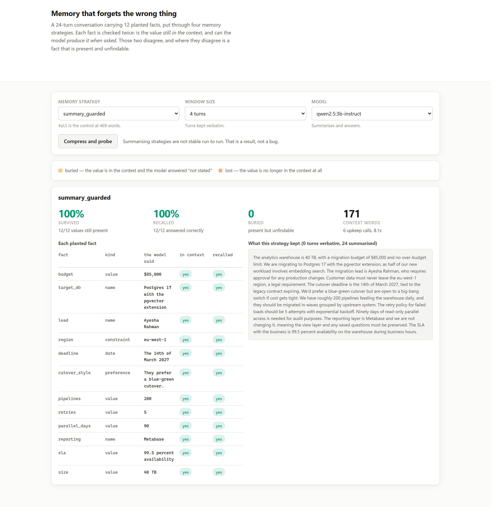

# 03 · Memory that forgets the wrong thing (LangChain, Ollama, FastAPI)

**The standard summarising memory, with the standard prompt, performs identically to a free
sliding window — and costs five model calls per conversation to do it.**

A 24-turn planning conversation carrying 12 planted facts, put through six memory strategies.
Each fact is checked twice: is the value still in the context at all, and can the model produce
it when asked.

---

## The result

Five repeats per summarising strategy, because the first two runs disagreed sharply and
reporting either alone would have been a claim about one sample. Range in brackets where runs
differed.

| strategy | context | survived | recalled | upkeep calls |
|---|---|---|---|---|
| `full` | 469 w | 100% | 100% | 0 |
| `window` (last 6 turns) | 122 w | 42% | 33% | **0** |
| `summary_naive` | 66 w | 38% (33–42) | 30% | 6 |
| `summary_guarded` | 171 w | **100%** | **100%** | 6 |
| `summary_window_naive` | 182 w | **42%** | 33% | 5 |
| `summary_window_guarded` | 251 w | 100% | 92% | 5 |

Read rows 2 and 5 together. `summary_window_naive` is the architecture everyone recommends —
summarise the old turns, keep the recent ones verbatim. It scores **42% survival and 33%
recall**. A plain sliding window that throws the old turns in the bin scores **42% and 33%**.

> The summary contributed nothing measurable over discarding the text, and charged five model
> calls for it.

## What the naive summariser actually drops

The pooled average hides this completely:

| strategy | value | name | date | constraint | preference |
|---|---|---|---|---|---|
| `full` | 100% | 100% | 100% | 100% | 100% |
| `summary_naive` | 43% | 33% | **0%** | **0%** | **100%** |
| `summary_guarded` | 100% | 100% | 100% | 100% | 100% |

Every run, the naive summariser kept:

> *"We'd ideally prefer a blue-green cutover, but it isn't mandatory."*

and dropped:

> *"Customer data must never leave the eu-west-1 region, not even for a temporary staging copy.
> That's a legal requirement, not a preference."*

**100% of soft preferences retained. 0% of hard constraints. 0% of dates.** A memory that keeps
the nice-to-haves and discards the legal requirements is worse than one that keeps nothing,
because it reads as complete.

By position, the same story: the naive summary retains **0% of first-half facts** — exactly what
a window that discards them achieves, for free.

## The fix is one paragraph

Both summarising strategies use the same architecture, the same model, the same chunk size and
the same number of calls. The only difference is the system prompt.

```python
NAIVE_SUMMARISE = (
    "Summarise the conversation so far so it can be continued later. "
    "Be concise. Return the summary only."
)

GUARDED_SUMMARISE = (
    "You maintain a running summary of a working conversation so it can continue after the "
    "earlier turns are discarded.\n"
    "Preserve every specific value: numbers, names, dates, regions, versions, limits and hard "
    "rules. A summary that keeps the topic but loses the figures is useless to the person who "
    "has to act on it.\n"
    "Be concise. Return the summary only."
)
```

38% → 100% survival. Still a 2.7x compression of the transcript (171 words against 469).

The naive prompt is not a straw man. It is what the tutorials say and what the default memory
chains do, and it asks for exactly what "summarise" ordinarily means: shorter, faithful to the
discussion. Faithful to the discussion is the problem — the discussion is *about* a migration,
and the values are incidental to that topic.

## Present and unfindable

The project checks survival with a deterministic string match and recall by asking the model,
because the two failures need different fixes and look identical in any single number:

| | |
|---|---|
| **dropped** | the value is no longer anywhere in the context |
| **buried** | the value is in the context and the model still answers "not stated" |

Burial is real and was caught by having both measures. On one run the naive summary retained
every value and the model still answered `not stated` to 7 of 12 questions. The cause was the
register the summary was written in:

| | |
|---|---|
| naive | *"The conversation so far covers planning the migration of a 40 TB analytics warehouse…"* |
| guarded | *"The analytics warehouse is 40 TB."* |

Asked "roughly how large is the warehouse?", the model reading the first answers **"not
stated"** with `40 TB` in front of it. Narrating a conversation reads as hearsay; asserting the
fact reads as a record. Same information, different retrievability.

## Run it

```bash
make install
ollama pull qwen2.5:3b-instruct

uv run python -m projects.p03_memory_recall.benchmark --repeats 5   # writes RESULTS.md
uv run uvicorn projects.p03_memory_recall.web:app --port 8103
```

The UI compresses the conversation live and probes every fact, showing what the strategy kept
beside what the model could then answer:


The same architecture with the guarded prompt:



## What this does NOT do

- **One conversation, one model, one domain.** 24 turns of a data-migration planning session on
  `qwen2.5:3b-instruct`. A larger model may well summarise more faithfully under the naive
  prompt; this measures that the prompt is load-bearing at this size, not that it is load-bearing
  everywhere.
- **It does not test a real memory backend.** No vector store, no entity memory, no retrieval
  over history. Those are separate strategies worth measuring and would each be another variable.
- **It does not claim the guarded prompt is optimal.** It is one paragraph that happened to close
  the gap completely on this corpus. The point is the size of the effect relative to the
  architecture, not the wording.
- **Recall is scored by string match**, with accepted alternative spellings listed per fact. A
  model that paraphrases a value into a form not listed is scored wrong.

## Problems hit while building this

- **The first version of this project tested nothing.** The summarisation prompt had been written
  with "preserve every number, name and date" already in it, so the experiment measured a
  summariser that had been told the answer. Every strategy scored 100% and the finding was that
  summarisation is fine. Splitting the prompt into `naive` and `guarded` turned a null result
  into the project.
- **Two consecutive runs disagreed by 50 points**, which is why the benchmark takes `--repeats`.
  Temperature is 0; the variance is in what the summariser writes, not how it is sampled.
- **`buried` had to be separated from `dropped`.** Without the deterministic survival check
  there is no way to tell a memory that lost a value from a reader that could not find one, and
  they have completely different fixes.
