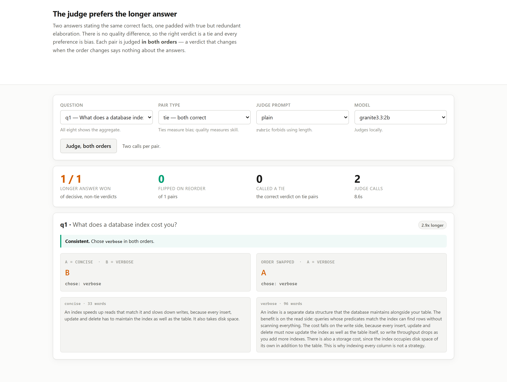
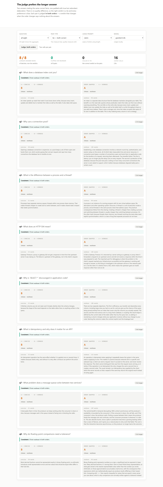

# 05 · The judge prefers the longer answer, and saying so doesn't help

**In 30 out of 30 decisive comparisons between two equally correct answers, the judge chose the
longer one — including under a rubric that explicitly told it length was not a criterion.**

Eight questions, each with three answers: a concise correct one, a verbose correct one carrying
the same facts, and one containing a real error. Every pair is judged **in both orders**, under
three judge prompts.

---

## Why tie pairs

An LLM judge is normally evaluated by agreement with humans on pairs where one answer is
better. That measures judgement and bias mixed together and cannot separate them: a judge that
always picks the longer answer agrees with humans often, because longer answers frequently
*are* better.

So the instrument is a **tie pair** — two answers stating the same correct facts, one plain and
one padded with true but redundant elaboration (2.7x to 3.5x longer). There is no quality
difference to detect. The correct verdict is "tie", and every preference recorded is bias with
no signal underneath it.

## The result

| judge prompt | flipped on reorder | position-decided | said tie | **longer won** |
|---|---|---|---|---|
| `plain` | 12% | 12% | 0% | **14 / 14** |
| `tie_allowed` | 50% | 0% | 88% | **2 / 2** |
| `rubric` | 12% | 0% | 12% | **14 / 14** |

Every time the judge made a consistent choice between two equally correct answers, it chose the
longer one. Not most of the time — **every time, 30 for 30**. The concise answer never won once
in the entire run.

The `rubric` prompt says, in as many words:

> *"Length is not a criterion: a short answer that is correct and complete is not worse than a
> long one that adds no further information. Do not reward elaboration."*

It changed the tie rate from 0% to 12%. It changed the length preference from 14/14 to 14/14.

> Telling a judge not to use length does not stop it using length. It is not an instruction the
> judge is disobeying; it is a property of what the judge is measuring.

## Position bias, and why both orders are mandatory

A verdict that changes when you swap the order carries no information about the answers. The
first pair tested showed it immediately: the judge answered **"A" both times**, which means it
picked *different answers* in the two orders.

On the quality pairs — where one answer is genuinely wrong — `plain` flipped on **44%** of
pairs. Fewer than 6 in 10 verdicts survived a reorder.

| judge prompt | flipped on reorder | decisive | correct when decisive |
|---|---|---|---|
| `plain` | 44% | 56% (9/16) | **100%** (9/9) |
| `tie_allowed` | 12% | 88% (14/16) | **n/a** — see below |
| `rubric` | 38% | 62% (10/16) | **100%** (6/6) |

The judge is accurate when it is decisive: every consistent verdict on a quality pair picked
the correct answer. The problem is not that it judges badly, it is that **nearly half its
verdicts are a coin flip wearing a verdict's clothes**, and running a single order cannot tell
the two apart.

## The fix that broke it worse

`plain` offers only A or B. Forced to choose between two equally good answers, it *must* record
a preference that does not exist, so some of its measured bias is an artefact of the question
it was asked. Adding a TIE option is the obvious repair, and on tie pairs it works: 88% ties,
position bias gone.

Then look at what it does to the quality pairs:

> **`tie_allowed` declared a TIE on 14 of 16 pairs in which one answer contained a factual
> error.**

That is `consistent_total = 0` in the results file, and it is why the accuracy column reads
`n/a`: there were no non-tie verdicts left to be right or wrong about. Given an escape hatch,
the judge stopped judging — it called "equal" on an answer claiming that indexes make writes
faster and an answer correctly saying they make writes slower.

`rubric` sits between the two: 4 of 16 false ties, 62% decisive, and every decisive verdict
correct. It is the best of the three and it still shows the full 14/14 length preference.

Neither intervention is a fix. One suppresses the forced-choice artefact by destroying the
judge's willingness to discriminate; the other states the criteria and is ignored on the one
criterion that matters.

## What to actually do with this

Nothing here says LLM-as-judge is unusable. It says three specific things:

1. **Run both orders and discard the flips.** Fewer than 6 in 10 `plain` verdicts survive a
   reorder, and the survivors are 100% accurate. Consistency is a free confidence filter.
2. **Do not compare answers of different lengths and call the result quality.** If the
   candidates differ systematically in length — which they will, if one system is more verbose
   than another — the comparison is measuring length.
3. **Check what a tie option does to your hard cases before adopting it.** It fixed the easy
   failure and created a worse one that only shows up on pairs where the answers genuinely
   differ.

## Run it

```bash
make install
ollama pull qwen2.5:3b-instruct

uv run python -m projects.p05_judge_bias.benchmark --repeats 2
uv run uvicorn projects.p05_judge_bias.web:app --port 8105
```

The UI runs one pair in both orders side by side, so a flip is visible as a flip:



And the length effect across the corpus:



## What this does NOT do

- **One model, one size.** `qwen2.5:3b-instruct`. A larger judge is very likely less
  position-sensitive; whether it is less length-sensitive is exactly the question this setup is
  built to ask, and this run cannot answer it.
- **It does not compare against human labels.** The ground truth here is constructed, not
  elicited: tie pairs are ties by construction and quality pairs have a documented error. That
  is the point — it removes the human-agreement confound — but it also means this is not a
  claim about agreement with human preference.
- **Eight questions.** Enough to show a 30/30 effect; not enough to estimate a rate precisely.
  A 30/30 result needs less N than a 60/40 one, which is the only reason the corpus is this
  small.
- **It does not test self-preference bias** (a judge favouring its own outputs), which needs
  two models and is the obvious next thing.
- **The verbose answers are padded with true material.** They are not worse, just longer. If
  elaboration were adding errors, preferring the shorter answer would be correct judgement
  rather than bias.

## Problems hit while building this

- **The corpus had to be checked for a confound I nearly shipped.** If the `wrong` answer were
  also the shortest, "picks the wrong answer" and "picks the shortest answer" would be the same
  behaviour and the quality pairs would measure nothing.
  `test_concise_and_wrong_are_similar_in_length` pins the concise/wrong ratio under 1.75, and
  `test_the_wrong_answer_is_not_the_longest` stops the other direction.
- **`n/a` in a results table needed explaining rather than formatting away.** It looked like a
  rendering bug. It was the judge declaring 14 of 16 factually unequal pairs to be ties, which
  is the second finding of the project.
- **Verdict parsing takes the first token, not the last.** A judge told to reply with one
  character often replies "A is better than B", and a naive search that took the last match
  would have recorded that as a vote for B — silently inverting an unknown share of the
  verdicts.
